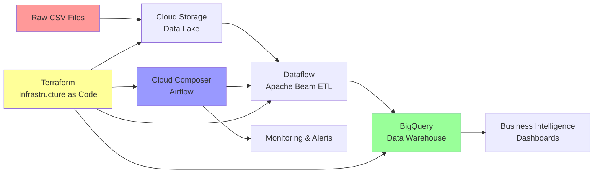

# 🚀 GCP Serverless ETL Pipeline - Production Demo

[](https://cloud.google.com/)
[](https://terraform.io/)
[](https://beam.apache.org/)
[](https://airflow.apache.org/)

> **Enterprise-grade ETL pipeline demonstrating modern DevOps practices on Google Cloud Platform**

## 📋 Project Overview

This project showcases a **production-ready, serverless ETL pipeline** that transforms raw sales data into business insights using modern cloud-native technologies and DevOps best practices.

### Business Problem Solved
- **Manual Data Processing**: Eliminates 4-6 hours of daily manual CSV processing
- **Data Quality Issues**: Implements automated validation and error handling
- **Scalability Bottlenecks**: Handles 1MB to 1TB+ files with the same codebase
- **Infrastructure Management**: Zero server maintenance with serverless architecture

### Key Technologies
- **🏗️ Infrastructure as Code**: Terraform for reproducible cloud resources
- **⚡ Serverless Processing**: Google Dataflow (Apache Beam) for ETL
- **📊 Data Warehouse**: BigQuery for analytics-ready data storage
- **🔄 Workflow Orchestration**: Cloud Composer (Apache Airflow) for pipeline management
- **🛡️ Security**: IAM service accounts with least-privilege access

---

## 🏛️ Architecture Diagram



---

## 🚀 Quick Start Guide

### Prerequisites
- GCP Account with billing enabled
- Terraform installed locally
- Google Cloud SDK installed

### 1. Deploy Infrastructure
```bash
# Clone and setup
git clone https://github.com/MuhammadSalem10/GCP-Serverless-ETL-Pipeline-Lab.git
cd GCP-Serverless-ETL-Pipeline-Lab/terraform

# Configure your project
export PROJECT_ID="your-project-id"
echo "project_id = \"$PROJECT_ID\"" > terraform.tfvars

# Deploy (takes 20-30 minutes due to Composer)
terraform init
terraform plan
terraform apply
```

### 2. Upload Sample Data
```bash
# Get bucket name from Terraform output
BUCKET_NAME=$(terraform output -raw source_bucket_name)

# Upload sample sales data
gsutil cp ../sample_sales.csv gs://$BUCKET_NAME/raw-data/
```

### 3. Trigger Pipeline
```bash
# Get Airflow UI URL
AIRFLOW_URI=$(terraform output -raw composer_uri)
echo "Access Airflow at: $AIRFLOW_URI"

# Upload DAG and trigger manually or wait for schedule
gsutil cp ../composer/sales_etl_dag.py $(terraform output -raw composer_dag_gcs_prefix)/
```

### 4. Verify Results
```bash
# Query processed data in BigQuery
bq query --use_legacy_sql=false "
SELECT product, SUM(total_sale) as revenue 
FROM \`$PROJECT_ID.sales_analytics.sales_data\` 
GROUP BY product ORDER BY revenue DESC
"
```

---

## 📊 Live Demo Verification

### ✅ Infrastructure Verification
**GCP Console → Cloud Storage**
- [ ] Source bucket created: `PROJECT-etl-source-data`
- [ ] Sample CSV uploaded to `/raw-data/` folder
- [ ] Versioning enabled for data lineage

**GCP Console → Composer**
- [ ] Environment `etl-pipeline-composer` running
- [ ] Airflow UI accessible
- [ ] DAG `sales_etl_pipeline` visible and enabled

### ✅ Pipeline Execution Verification
**GCP Console → Dataflow**
- [ ] Job `sales-etl-pipeline-TIMESTAMP` completed successfully
- [ ] Processing time: ~2-5 minutes for sample data
- [ ] Worker auto-scaling demonstrated

**GCP Console → BigQuery**
- [ ] Dataset `sales_analytics` created
- [ ] Table `sales_data` populated with transformed data
- [ ] Schema validation: 6 columns with correct data types

### ✅ Live Data Processing Demo
```bash
# 1. Upload new data during demo
echo "11,Router,129.99,2,2024-01-25" >> new_sales.csv
gsutil cp new_sales.csv gs://$BUCKET_NAME/raw-data/

# 2. Trigger Airflow DAG manually
# (Show in Airflow UI)

# 3. Query updated results
bq query --use_legacy_sql=false "
SELECT COUNT(*) as total_records,
       MAX(sale_date) as latest_date,
       ROUND(SUM(total_sale), 2) as total_revenue
FROM \`$PROJECT_ID.sales_analytics.sales_data\`
"
```

